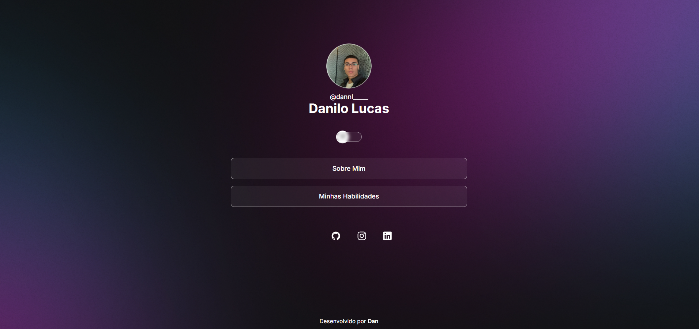
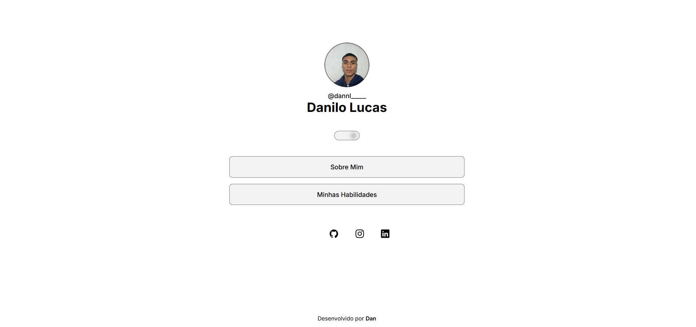

<h1 align="center">💻 DevLinks - Danilo Lucas</h1>

  
  

  <strong>🌙 Tema escuro</strong> | <strong>☀️ Tema claro</strong>

---

### 🧠 Sobre o projeto

O **DevLinks** é uma página de links personalizada, feita com **HTML, CSS e JavaScript**, inspirada no projeto da **Rocketseat**.  
Permite alternar entre **modo claro e escuro**, com design responsivo e animações suaves.

---

### 🚀 Tecnologias utilizadas

- HTML5
- CSS3 (variáveis, flexbox e animações)
- JavaScript (DOM e modo dark/light)

### 🔗 Acesse o projeto

👉 [Clique aqui para ver online](https://danilolucaxs.github.io/portfolio-danilo/)

---

### 💬 Autor

Feito por **[Danilo Lucas](https://linkedin.com/in/danilolucaswork/)**  
Siga e contribua com meus projetos!

# portfolio-rocketseat-
